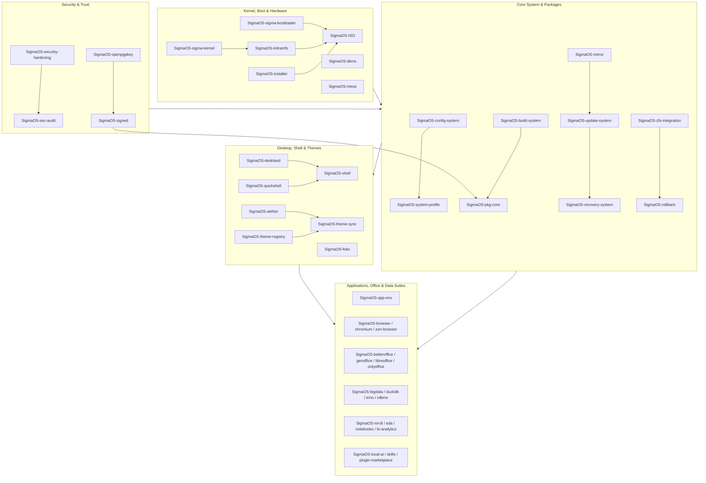

# SigmaOS Component Map

> Visual dependency and subsystem map of the SigmaOS ecosystem.

```mermaid
flowchart TB
    subgraph KernelBoot["Kernel, Boot & Hardware"]
        kernel["SigmaOS-sigma-kernel"]
        boot["SigmaOS-sigma-bootloader"]
        initramfs["SigmaOS-initramfs"]
        dkms["SigmaOS-dkms"]
        mesa["SigmaOS-mesa"]
        iso["SigmaOS-ISO"]
        installer["SigmaOS-installer"]
        kernel --> initramfs
        boot --> iso
        initramfs --> iso
        installer --> iso
    end

    subgraph CoreSys["Core System & Packages"]
        cfg["SigmaOS-config-system"]
        prof["SigmaOS-system-profile"]
        pkg["SigmaOS-pkg-core"]
        build["SigmaOS-build-system"]
        upd["SigmaOS-update-system"]
        rec["SigmaOS-recovery-system"]
        roll["SigmaOS-rollback"]
        zfs["SigmaOS-zfs-integration"]
        mirror["SigmaOS-mirror"]
        cfg --> prof
        build --> pkg
        mirror --> upd
        zfs --> roll
        upd --> rec
    end

    subgraph Security["Security & Trust"]
        hard["SigmaOS-security-hardening"]
        audit["SigmaOS-sec-audit"]
        signed["SigmaOS-signed"]
        pgp["SigmaOS-openpgpkey"]
        pgp --> signed
        signed --> pkg
        hard --> audit
    end

    subgraph Desktop["Desktop, Shell & Themes"]
        desk["SigmaOS-deskland"]
        shell["SigmaOS-shell"]
        qs["SigmaOS-quickshell"]
        aether["SigmaOS-aether"]
        treg["SigmaOS-theme-registry"]
        tsync["SigmaOS-theme-sync"]
        folio["SigmaOS-folio"]
        desk --> shell
        qs --> shell
        aether --> tsync
        treg --> tsync
    end

    subgraph Suites["Applications, Office & Data Suites"]
        appenv["SigmaOS-app-env"]
        browser["SigmaOS-browser / chromium / zen-browser"]
        office["SigmaOS-betteroffice / genoffice / libreoffice / onlyoffice"]
        data["SigmaOS-bigdata / duckdb / trino / rdbms"]
        ml["SigmaOS-ml-dl / eda / notebooks / bi-analytics"]
        ai["SigmaOS-local-ai / skills / plugin-marketplace"]
    end

    KernelBoot --> CoreSys
    Security --> CoreSys
    CoreSys --> Desktop
    Desktop --> Suites
    CoreSys --> Suites
```

See [Home](./Home) for the full alphabetical and categorized index of all components.
